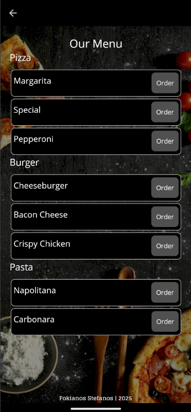
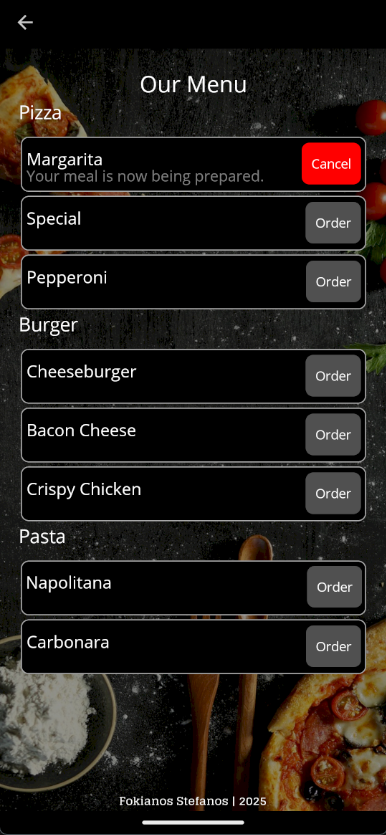
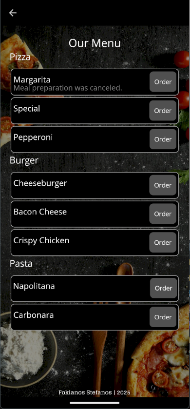
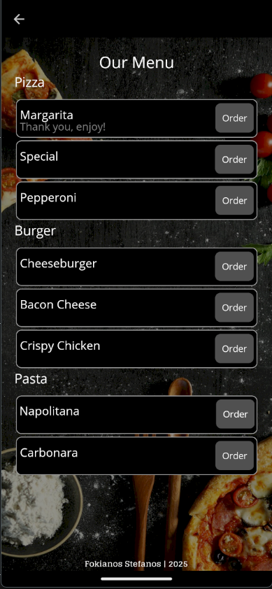

# FoodApp 

Welcome to **FoodApp**, an in progress mobile application built with .NET MAUI that lets users browse and order from a variety of delicious food options. With a simple interface and smooth user experience, FoodApp makes it easy to select, order, and track your meal preparation process.

## Features

- **Browse Menu**: View a categorized list of food items, neatly displayed using a collection view.
- **Order Food**: Select your favorite food and order with a single tap.
- **Cancel Order**: Change your mind? Easily cancel your order while it’s being prepared.
- **Meal Status**: Real-time updates on the preparation status of your meal.
- **Responsive Design**: Optimized for a seamless experience across various screen sizes.

## How to Use the App

1.  **Welcome**: The user is greeded with a Welcome Page
     
2.  **Browse the Menu**: Open the app to view a categorized list of food items.
     
3. **Order**: Tap the "Order" button next to your chosen food item.
     
4. **Cancel Order**: If the meal is being prepared, you can cancel the order by tapping the "Cancel" button.
     
5. **Collect Meal**: Once your meal is ready, tap the "Collect" button to complete the process.
     
6. **Thank you!**: Your order is now collect. Thank you for using FoodApp!
     

   You can make multiple orders at once.
    

   You can collect multiple orders.
    

   You can cancel multiple orders.
    


## How to Clone and Run the Project from GitHub 🔧

Follow these steps to clone and run the project on your local machine:

### Prerequisites

- **.NET MAUI**: Make sure you have the latest version of .NET MAUI installed.

### Running the app 

1. Open a terminal or command prompt.
2. Run the following command to clone the repository:
   ```bash
   git clone https://github.com/yourusername/FoodApp.git
3. Open the project in your favorite IDE that supports .NET MAUI (App was built in Visual Studio 2022).
4. Build the project
5. Run the application on an emulator or a physical device.

## Bugs:
Tested on Pixel 7 - Android 15.0 Emulator and Xiaomi Redmi note 8 - Android 11.0 physixal device with no bugs found.


Feel free to explore, use, and contribute to FoodApp. Happy ordering! 🍽️
